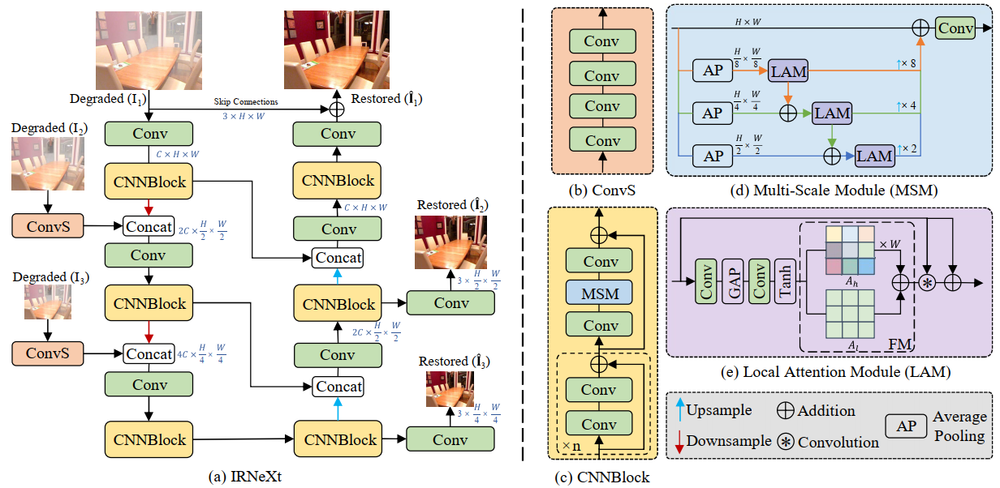

# IRNeXt: Rethinking Convolutional Network Design for Image Restoration
Yuning Cui, Wenqi Ren, Sining Yang, Xiaochun Cao, Alois Knoll

 ## Abstract
We present IRNeXt, a simple yet effective convolutional network architecture for image restoration. Recently, Transformer models have dominated the field of image restoration due to the powerful ability of modeling long-range pixels interactions. In this paper, we excavate the potential of the convolutional neural network (CNN) and show that our CNN-based model can receive comparable or better performance than Transformer models with low computation overhead on several image restoration tasks. By re-examining the characteristics possessed by advanced image restoration algorithms, we discover several key factors leading to the performance improvement of restoration models. This motivates us to develop a novel network for image restoration based on cheap convolution operators. Comprehensive experiments demonstrate that IRNeXt delivers state-of-the-art performance among numerous datasets on a range of image restoration tasks with low computational complexity, including image dehazing, single-image defocus/motion deblurring, image deraining, and image desnowing.
 ## Architecture 

## Installation
The project is built with PyTorch 3.8, PyTorch 1.8.1. CUDA 10.2, cuDNN 7.6.5
For installing, follow these instructions:
~~~
conda install pytorch=1.8.1 torchvision=0.9.1 -c pytorch
pip install tensorboard einops scikit-image pytorch_msssim opencv-python
~~~
Install warmup scheduler:
~~~
cd pytorch-gradual-warmup-lr/
python setup.py install
cd ..
~~~

## Citation
If you find this project useful for your research, please consider citing:
~~~
@inproceedings{IRNeXt,
author = {Cui, Yuning and Ren, Wenqi and Yang, Sining and Cao, Xiaochun and Knoll, Alois},
title = {IRNeXt: Rethinking Convolutional Network Design for Image Restoration},
year = {2023},
booktitle = {Proceedings of the 40th International Conference on Machine Learning},
}
~~~
## Contact
Should you have any question, please contact Yuning Cui.